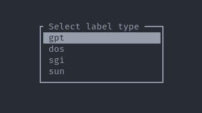
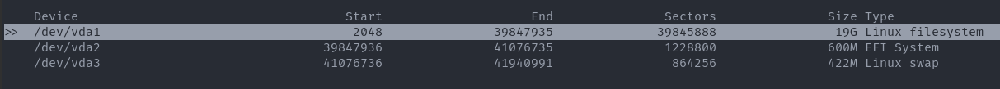
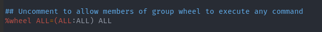

# Archilinux Instalation 

1). Enable SSHD to perform the instalation from a remote machine:
```
# systemctl enable --now sshd
```
2). Check the Arch live system ip:
```
# ip a
```
3). Add a empty password to connect from the remote machine:
```
# passwd
```
Set an empty password.

4). Set the timedate auto configured througout network:
```
# timedatectl set-ntp true
# timedatectl status
```
Check that syncronized is `yes`

5). Select the disk for partitioning:
```
# cfdisk
```
Chose `gpt` option: 



Select type `Linux filesystem` for the biggest partition. `EFI System` for the boot partition and `Linux swap` for the swap:



6). Format the partitions:
```
# mkfs.ext4 /dev/vda1
# mkfs.vfat /dev/vda2
# mkswap    /dev/vda3
```
7). Turn on swap:
```
# swapon /dev/vda3
```

8). Mount the filesystem:
```
# mount /dev/vda1 /mnt
```

9). Install the system:
```
# pacstrap /mnt linux linux-firmware base base-devel vim dhcpcd networkmanager netctl
```

10). Prepare the boot partition:
```
# mkdir -p /mnt/boot/efi
# mount /dev/vda2 /mnt/boot/efi
```
11). Change the arch root dir:
```
# arch-chroot /mnt
```

12). Syncronize the hardware clock:
```
# hwclock --systohc
```

13). Add a user with default groups:
```
# useradd -mG wheel,audio,video,optical,storage,input jose
# passwd jose
```

14). Enable `wheel` group:
```
# vim /etc/sudoers
```



15). Generate locales:

Add `en_US.UTF-8 UTF-8` to `/etc/locale.gen`:
```
# vim /etc/locale.gen
```

Add `LANG=en_US-UTF-8` to `/etc/locale.conf`:
```
# vim /etc/locale.conf

# locale-gen
# exit
```

16). Generate fstab file:
```
# genfstab -U /mnt >> /mnt/etc/fstab
```

17). Configure zone info:
```
# arch-chroot /mnt
# ln -sf /usr/share/zoneinfo/America/Bogota /etc/localtime
```

18). Configure Grub:
```
# pacman -S grub efibootmgr
# grub-install --target=x86_64-efi --efi-directory=/boot/efi --bootloader-id=GRUB
# grub-mkconfig -o /boot/grub/grub.cfg
```

19). Exit and reboot:
```
# exit
# systemctl reboot
```

20). Login and enable `dhcpcd`:
```
$ sudo systemctl enable --now dhcpcd
```

21). Install openssh:
```
$ sudo pacman -Sy openssh
```

22). Install git python-pip:
```
$ sudo pacman -Sy git python-pip
$ pip3 install expect
```

23). Install zsh and ohmyzsh:
```
$ sudo pacman -Syu zsh
$ chsh -s /usr/bin/zsh
$ sh -c "$(curl -fsSL https://raw.github.com/ohmyzsh/ohmyzsh/master/tools/install.sh)"
```

23). Install linuxbrew:
```
$ sh -c "$(curl -fsSL https://raw.githubusercontent.com/Linuxbrew/install/master/install.sh)"
$ test -d ~/.linuxbrew && eval $(~/.linuxbrew/bin/brew shellenv)
$ test -d ~/.linuxbrew && eval $(~/.linuxbrew/bin/brew shellenv)
$ test -d /home/linuxbrew/.linuxbrew && eval $(/home/linuxbrew/.linuxbrew/bin/brew shellenv)
$ test -r ~/.bash_profile && echo "eval \$($(brew --prefix)/bin/brew shellenv)" >>~/.zshrc
$ echo "eval \$($(brew --prefix)/bin/brew shellenv)" >>~/.zprofile
```

24). install yay (make sure the Go binary is from pacman and not linuxbrew):
```
$ sudo pacman -Syu --needed base-devel git
$ cd Code && git clone https://aur.archlinux.org/yay.git
$ cd yay && makepkg -si 
```
25). install ansible plugins in your local ansible machine:
```
$ ansible-galaxy collection install community.general
```

26). install networkmanager-dmenu
```
$ yay -Syu networkmanager-dmenu
```

27). install paper theme
```
$ yay -Syu paper-gtk-theme-git
$ yay -Syu paper-icon-theme-git
```

26). Run make to setup the new install:
```
$ make foundations 
```
